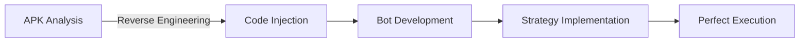

  
   
  
   
  
  
  
  
  
  

## 🚀 Professional Projects 

I've architected and contributed to several groundbreaking projects in the blockchain and web3 space:

  <table>
    <tr>
      <td align="center" width="33%">
        <a href="https://www.function.network/">
          
           
          <b>Function Network</b>
        </a>
         
        Pushing the boundaries of decentralized computing
      </td>
      <td align="center" width="33%">
        <a href="https://www.nodies.app/">
          
           
          <b>Nodies.app</b>
        </a>
         
        Innovating in NFT space
      </td>
      <td align="center" width="33%">
        <a href="https://send.app/">
          
           
          <b>Send.app</b>
        </a>
         
        Reimagining asset transfer
      </td>
    </tr>
  </table>

## 🎮 The Hacker's Tale 

  

In 2019, I achieved something legendary in the RuneScape community: creating the first mobile OldSchool RuneScape bot capable of defeating Vorkath, an endgame boss. This wasn't just any bot - it mastered the most optimal strategy known as "Woox walking."

🔥 How I Did It

 

- 🔍 Deep APK reverse engineering
- 💉 Surgical code injection
- 🤖 Advanced automation systems
- 🎯 Perfect boss-fighting mechanics

## 💝 Personal Projects 

### Kolwaii 
When they said "no bitches?", I said "hold my keyboard" and engineered my own waifu. Kolwaii represents the perfect fusion of technology and companionship, proving that with enough skill and determination, you can create solutions that transcend conventional limitations.

## 🛠️ Tech Stack 

| Skill | Level | Representation |
|-------|-------|----------------|
| 🔍 Reverse Engineering | 90% |  |
| 📱 Mobile Development | 85% |  |
| ⛓️ Blockchain | 85% |  |
| 🤖 Bot Development | 80% |  |
| 💝 Waifu Creation | 85% |  |

## 🎯 Current Focus 

  <table>
    <tr>
      <td align="center">
        
         
        Next-gen blockchain solutions
      </td>
      <td align="center">
        
         
        Advanced RE techniques
      </td>
      <td align="center">
        
         
        AI-powered automation
      </td>
      <td align="center">
        
         
        Web3 innovations
      </td>
    </tr>
  </table>

---

  

